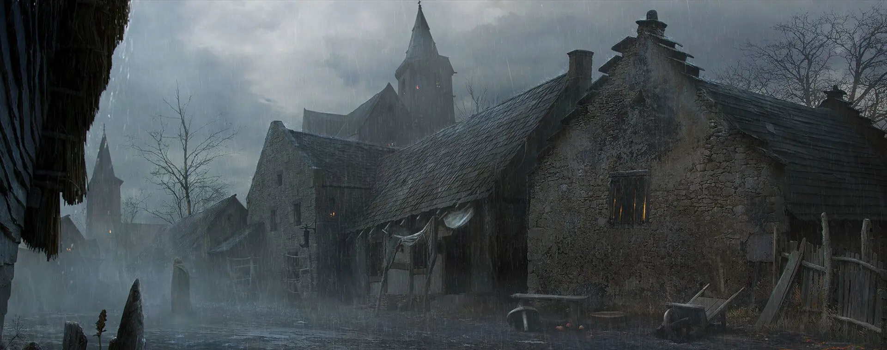

---
{"title":"Settlement_Template","draft":false,"tags":null,"publish":true,"name":"Untergard †","aliases":"","category":"Dorf","usage":"Knotenpunkt, Umschlagplatz","location":"Imperium, Middenland","nation":"Imperium","population":"ca 120","inhabitants":"Menschen, Halblinge","condition":"Verlassen, Ruine","governance":"Föderalismus, Bürgermeister","leaders":"Zacharias Kreuzhof","people":"Zacharias Kreuzhof, Arnulf Schiller, Ottwin Plaffbach, Goran Uhl","seat_of_power":"Rathaus","relations":"Grimminhagen, Middenheim, Imperium (Lehnstreue)","organizations":"","places":"Rathaus von Untergard, Zum Blauen Wasser, Quintus' Kuriositäten, Bootshaus Freithal, Sigamarskirche","commerce":"Freie Markwirtschaft, Holz, Pelze, Leder (Exporte)","religions":"Sigmarskult, Ulricskult","defence":"Stadtmauern, Stadtwache","PassFrontmatter":true}
---

# Untergard †

---
> [!infobox]
> 
> 
> ## **Untergard †**
> 
>
> 
> ## - Fakten -
> |  |  |
> | ---- | ---- |
> | **Aliase** | `=this.aliases` |
> | **Kategory** | Dorf |
> | **Funktion** | Knotenpunkt, Umschlagplatz |
> | **Lage** | Imperium, Middenland |
> | **Nation** | Imperium |
> | **Bevölkerung** | ca 120 |
> | **Einwohner** | Menschen, Halblinge |
> | **Zustand** | Verlassen, Ruine |
> | **Regierungsform** | Föderalismus, Bürgermeister |
> | **Regierung** | Zacharias Kreuzhof |
> | **Wichtige Personen** | Zacharias Kreuzhof, Arnulf Schiller, Ottwin Plaffbach, Goran Uhl |
> | **Regierungssitz** | Rathaus |
> | **Beziehungen** | Grimminhagen, Middenheim, Imperium (Lehnstreue) |
> | **Organisationen** | `=this.organizations` |
> | **Wichtige Orte** | Rathaus von Untergard, Zum Blauen Wasser, Quintus' Kuriositäten, Bootshaus Freithal, Sigamarskirche |
> | **Wirtschaft** | Freie Markwirtschaft, Holz, Pelze, Leder (Exporte) |
> | **Verteidigung** | Stadtmauern, Stadtwache |
> | **Glaube** | Sigmarskult, Ulricskult |
> 

 

> [!quote|author clean] *"This is the first Quote."*
> The Quoted, at place X, at time Y

> [!quote|author clean] *"This is the second Quote."*
> The Quoted, at place X, at time Y

 

## Grundlegendes:

Basic decription, summary and highlighting of details of note

 

## Regierung:

- What is the governmental system?
- Who are its leaders and notable political groups?
- What is its relationship with other settlements or nations?

 

## Verteidigung:

- Does it have walls? Are they fortified?
- Does it have fortifications? Which ones and where?

### Stadtwache & Armee:

- What is the name of its law enforcement, and its defensive forces?
- Standing army or militia?
- How strict or relaxed is law enforcement?

 

## Soziales:

[City] has a population of XX‚XXX. The majority are [race], with a significant number of [race] and [race], and enclaves of [race].

- Social Welfare: Indifferent or benevolent (Comes in shades)
- What is the overall social hierarchy and how do they interact?
- What is the general standard of living?

### Soziale Einrichtungen:

- Who are the main social institutions and organizations and how do they interact?

 

## Kultur:

- What are some of its unique cultural traditions or customs?
- What is the general attitude towards cultural diversity?

### Cultural Institutions:

- What are organizations or landmarks with cultural significance? 

### Celebrations:

- What are some of its festivals or holidays?

 

## Economy:

- Is the Economy regulated or free? (Comes in shades) A few details will do
- What are its primary industries?
- What are the primary exports and imports?
- Does it have trade connections?
- Is there a black market?

### Major Businesses:

- What are some of its notable financial institutions or businesses?

 

## Geographie: 

Geography, Climate, Urban Structure

- What are its climate and surrounding terrain, and natural resources?
- How is it located in relation to other important locations, and routes?

### Urban Structure:

- How big is the city, and how is it divided?
- What are notable features or landmarks?

 

## Law & Crime:

[City] has a [level] level of criminal activity. Most being [type of crime], or [type of crime].

- What is the overall crime rate?
- Does it have organized crime or any major criminal organizations operating in it?
- What are the dangerous areas, if any?

### Rule of Law

- How does its justice system work?
- What are some notable laws or policies?
- How are crimes handled and by whom?
- Reform or Punishment?

 

## Religion

- What is the attitude towards religion and religious diversity?

### Religions & Faiths

- What is the dominant religion?
- What are secondary, and minor religions?

### Temples & Shrines

- What are its religious buildings, organizations, or landmarks?

---

## Local History

 

### 
 - Founding (Date) - 

Why, when, and how was its foundation?

### 
 - Event (Date) - 

Description / Key Points about the event

---

## Myths & Deeds:

>[!Warning| clean no-i] *"Title1"*
> Write one or more well-known storys such as a myth or deed.
---
>[!Warning| clean no-i] *"Title2"*
> Write one or more well-known storys such as a myth or deed.
---