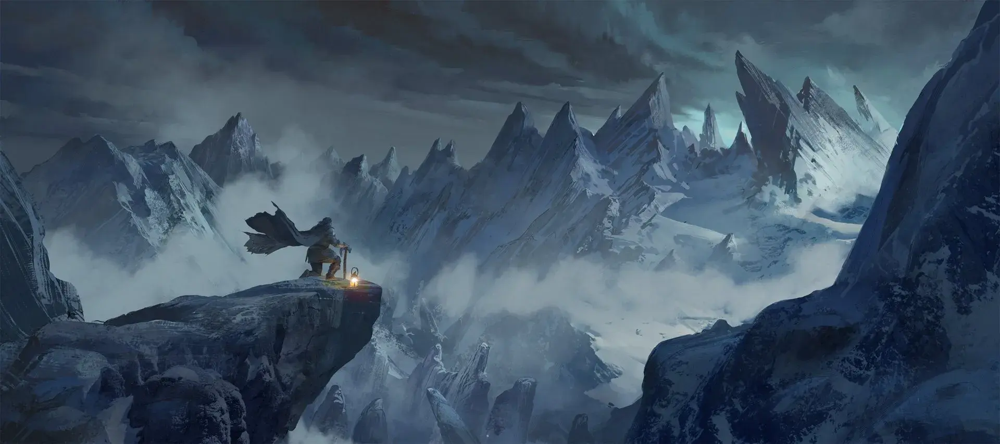

---
{"source":"Test","publish":true,"draft":false,"title":"Auf der Spur des Bären, Kapitel 2","tags":["Tagebuch"],"kampagne":"DVG","PassFrontmatter":true}
---

# Auf der Spur des Bären, Kapitel 2

---

> [!infobox| c-red]
>
>
> ### Auf der Spur des Bären, Kapitel 2
>
> 
> 
> |  |  |
> | ---- | ---- |
> | **RL Datum** | 20.10.2022 |
> | **Ereignisse von** | `=[[DVG Ep2]].IngameDateStart` |
> | **bis** | `=[[DVG Ep2]].IngameDateEnd` |
> | **Dramatis Personae** | Yuri Barkov, Vasili Eikrev, Mikael Grikov, Fafnir, Cawley, Sikka, Ursun |
> | **Orte Besucht** | Das Lager im Canyon, Schrein im Schwarzblut-Pass |
> | **Ziele & Pläne** | Das Lager erreichen, Yuri retten |
> | **Erfolge** | Yuri lebt, Das Lager wurde erreicht |
> | **Gegenstände** | `=[[DVG Ep2]].Loot` |

## Ereignisse:

"Die Kälte findet keinen Einzug wenn man in Bewegung ist" denkt sich Kuki um Schmettert weiter auf die dämonischen Bestien ein.
Die Rekken machen nach einer kurzen Aufwärmphase kurzen Prozess.
Die dämonischen Kreaturen konnten mit Spalthieben und Schwertschlitzen dem Boden gleich gemacht werden.
(Lilane Scherenfrau, Summenden Leiche voll Fliegen, Tentakeldämon mit  100 Augen, Teufel, Schattenhund und Kleine Pestbeulen und ein Zweiköpfiger-Wolf)

Doch Juri ist stark verletzt und wird in das Lager zurückgetragen. Der Weg zehrt an der inneren Wärme der Kundschafter, doch vergebens waren die Strapazen keinesfalls.

Der Geisterbär Ursun ist ihnen Erschienen, als der Kampf beendet war. 
"Gut gekämpft, dies ist der erste Schritt, ich werde euch nach 
Derwingrad führen, vertraut den Zeichen und folgt meiner Stimme"

Noch bevor die Gruppe den Altar verlassen konnte zeigte sich eine unmenschliche Gestalt. Bork berichtet, dass seine Späher einmal von einer "Einsiedlerin Sicka" gehört hätten. 
Sie macht oder möchte etwas mit den Leichen machen und spricht davon "ihre liebsten in den Wind zu legen".
Fordert uns doch gleichzeitig auf zu gehen. 

Goran trägt Yuri ein gutes Stück, lässt jedoch als auch seine Kräfte schwinden, die anderen auch helfen. 

Zum Glück erreichen wir das Lager noch in dieser Nacht "Gott ich hasse diese Kälte", denkt sich Kuki.
Als wir  im Lager ankommen, schicken wir sofort nach allen verfügbaren Heilern.
 
Michael Grinkof (der seine Bedenken geäuster hatte und meinte wir sollen zurück nach Prag gehen) ist ebenfalls in Juris Kommandozelt.

Der Heiler (Vasili) kommt reingestürmt um die Gruppe zu verarzten,  insbesondere Juri.
Während Kuki das erbeutete Schwert des Teufel-Dämons betrachtet, spürt er, dass es sehr wohl dazu geeignet ist in einer Schlacht sein Werk zu vollbringen.

Vasili sagt zu xxxx, dass Sie morgen reden müssen.

Bork schnappt sich seinen ersten Mann und schickt ihn zu Yuri, er soll die Nacht überleben..."aber stell dich geschickt an" betont Bork.

Kahun fragt nach etwas zu trinken und bekommt ein volles trinkhorn schaales Met, was sie in einem wegzieht um sich danach schlafen zu legen.

Alle bekommen 3 XP 
Kapitel - Auf den Spuren des Bären - abgeschlossen