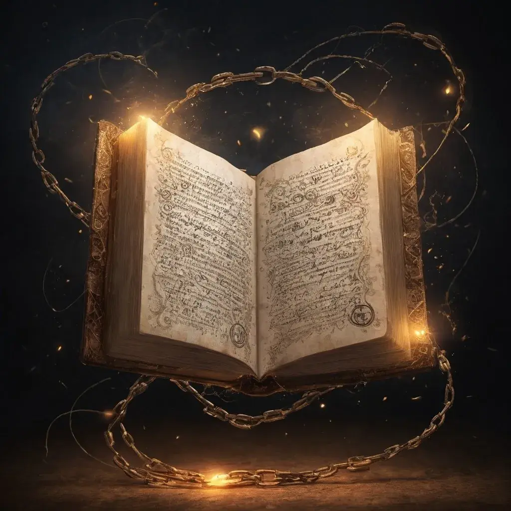

---
{"source":"Test","publish":true,"draft":false,"title":"Eine kurze Atempause","tags":["Tagebuch"],"kampagne":"DVG","PassFrontmatter":true}
---

# Eine kurze Atempause

---

> [!infobox| c-red]
>
>
> ### Eine kurze Atempause
>
> 
> 
> |  |  |
> | ---- | ---- |
> | **RL Datum** | 24.11.2022 |
> | **Ereignisse von** | `=[[DVG Ep6]].IngameDateStart` |
> | **bis** | `=[[DVG Ep6]].IngameDateEnd` |
> | **Dramatis Personae** | Yanya Kotova, Yuri Barkov, Vasili Eikrev, Fafnir, Cawley, Ivan |
> | **Orte Besucht** | Wachturm von Leuchtfeuer, Leuchtfeuer |
> | **Ziele & Pläne** | Leuchtfeuer erreichen |
> | **Erfolge** | Leuchtfeuer erreicht |
> | **Gegenstände** | `=[[DVG Ep6]].Loot` |

## Ereignisse:

Auf Juri folgen Mikael, Cawley, und Fafnir und einige mehr; sie betreten den Turm und alle begrüßen sich. Zwischen Goran und Juri fällt die Umarmung ungewöhnlich lieblos aus. Juri steht stramm aber sieht etwas ausgezehrt und härter aus. Juri berichtet, dass der Trupp von Sikah und ihren Schergen überfallen wurde. Der Große von ihren Schergen scheint noch größer geworden zu sein… Gleichzeitig fiel Skolden mit seinen Mannen auch über den Trupp her. Ob das ein koordinierter Angriff war ist schwer zu sagen. Sikah ist nach dem Kampf nach Süden geflohen. 
Juri erfährt verärgert, dass Slavin Kurnz die Stadt nicht gehalten hat und geflohen ist. Juri erklärt, dass Skolden mit 4 anderen Gefährten – seiner Leibwache- angegriffen hat. Ein Magier kann teleportieren, lässt Dinge explodieren und es ist nicht an ihn heranzukommen(aber er „fällt um, wenn Karhun ihn anspuckt“). Skolden („ein dünner Hering“)führt wohl ein magisches Schwert, dass unüblich schnell und stark ist. Eine blitzschnelle Speerkämpferin die gerne Leute aufschlitzt und ein aufgedunsener, langsamer, starker  Koloss. Ein Hammerkämpfer mit brennender Hand ähnelt Karhuns Kampfstil.
Kuki zeigt Vasili den Trank des Halblings, er ist warm und Kuki wärmt sich sofort an ihm. Vasili versorgt Karhun mit einem Trank und Karhuhn geht es (ein kleines bisschen) besser. 
Vasili untersucht die Leichen und ruft plötzlich entsetzt, dass wir hier sofort verschwinden müssen. Sie haben ROTE POCKEN! (Bork erinnert sich zwar nicht daran wie die Krankheit übertragen wird, aber weiß noch dass die Krankheit durch Schüttelfrost, Fieber etc, endgültig zum Verbluten führt). Und Vasili rennt, wir folgen. Um die Pocken auszulöschen, beschließen wir den Turm mitsamt der Gefangenen in Flammen zu setzen.
Corley berichtet, dass Leuchtfeuer von uns eingenommen wurde!
Im Weggehen hören wir die Schmerzensschreie der Gefangenen im lichterloh brennenden Turm. Wir folgen dem Pass Richtung Leuchtfeuer. Kuki sieht, dass in den Häusern Leuchtfeuers Lichter brennen.
Wir (und wahrscheinlich nur wir in unseren Köpfen) hören einen Donner und die Stimme Ursuns, der uns rät weiter nach Norden zu reisen und Zuflucht zu suchen. Juri scheint es auch gehört zu haben. Wir erreichen die Brücke am Fluss und erkennen bekannte Gesichter und betreten Leuchtfeuer. Einige Zivilisten tummeln sich unter unseren Leuten. Leuchtfeuer stellt sich als ein kleines Dorf ohne jegliche Verteidigung dar. Während wir an einer Taverne ankommen hören wir ein schrilles Lachen im Wind. Wir betreten die Taverne und Goran trifft seinen ersten Mann Ivan, der zwei Gefangene gemacht hat. Aus Süden kommen Corley und Fafnir. Corley hat die Eishexe gefunden und in einem Verschlag untergebracht. Karhun und Bork gehen mit ihm. Fafnir berichtet, dass einige seiner Männer einen Trupp angegriffen haben und sind nun in schlechtem Zustand, Kuki und Vasili gehen zu ihnen. Gorhan will sich mit Juri zusammen setzen und das weitere Vorgehen besprechen, Juri lehnt aber ab. Gorhan und Karhun unterhalten sich über Juris Verhalten, das ebenso wie seine Heilung etwas seltsam erscheint.  Karhun dreht sich kurzfristig von Bork ab und folgt Gorhan zu den Gefangenen. Die Gefangenen liegen gefesselt in einem verwüsteten Bauernhaus, neben einigen Wachen. Karhun verpasst dem nächsten Gefangenen einen Tritt. Sie können Brand- und Schnittwunden, fehlende Finger und Prellungen an ihnen erkennen. Karhun tritt ihm zwei Zähne aus. Er plaudert. „Skolden sollte schon längst hier sein, er ist nicht zum vereinbarten Zeitpunkt aufgekreuzt“ „Er wird den Norden von Ungläubigen befreien“ „Der Bojar ist nach Norden geflohen,
der Feigling“. Karhun tritt ihn schon wieder brutal. Gorhan sieht plötzlich eine Vision Ursuns: „Manche Dinge müssen sein, und manche Dinge muss man genießen. Genieße dass was getan werden muss“. 

Bork kommt mit Corley an der Hütte an, die ist auf Saunatemperatur geheizt. Die Eishexe, weiß blondes Haar im Zopf, leichte Kette, Stab silber- goldenes Kleid, zitternd. Sie friert weil sie sich in einem Eispanzer eingeschlossen hat als der Angriff kam. 
Eisblau silbrige Augen erkennen, dass Bork Zauber beherrscht, aber er kein Zauberer ist. Sie erklärt, dass Bork riesiges Potential für Magie in sich trägt. 
„Die Universität Kislev und Altdorf würde dich sofort aufnehmen“
„Spürst du die Winde des Chaos?“ Sie stellt die Frage, ob unsere Visionen wirklich eine Vision Ursuns sein kann.
Sie zuckt zusammen und bricht das Gespräch ab. Sie übergibt Bork einen schwarz-grünen Edelstein (30FP!) und ein Pergament.
Kuki geht zu einem großen Zelt mit wärmenden Feuer und Kukis Mannschaft ist um ihn. Viele erbrechen und bluten vor sich hin und leiden. Vasili springt zurück. Fafrir erzählt, dass sie Marodeure gejagt hatten und dann so zurück kamen. 
Kuki schaltet schnell und verlässt mit Vasili das Zelt, es sind die ROTEN POCKEN! Er befiehlt, dass niemand Kontakt zu den Männern im Zelt haben darf. Sie gehen zu den Marodeuren und untersuchen die Leichen. Es sind die selben wie im Turm, keine frischen Wunden oder ausgemergelte Körper. Vasili:„Es sind die Überlebenden der Pocken!“ „Die Adern sind Zeichen der aktiven Krankheit, nur einer von 1000 kann das sonst überleben?!“ Beim untersuchen findet Kuki ein Wolfmedaillon an den Leichen. Kuki zeigt das Medaillon aus seiner Tasche Vasili. Dieser schlägt vor, dass Medaillon zu zerstören, sodass Skoldens Macht nicht auf uns über geht. Kuki sieht plötzlich die Vision Ursuns erscheinen. Ursun sieht sehr mit  „Was den deinen Geschehen ist soll so nicht sein, du kannst es ändern. Steh ein für die deinen. Nimm ihr Leid auf dich, in dich ein, ihnen soll geholfen sein. Sei der standhafte Recke den sie brauchen“ – Wie? „Akzeptiere es“. Kuki hört ein Krähen und ene recht mitgenommene Krähe fliegt aus dem Zelt und nimmt auf seiner Schulter. Er bekommt einen Hustenanfall und wird in die Knie gezwungen vor Brummen und Dröhnen. 

Bork nimmt den Stein und das Pergament entgegen und spürt einen Schmerz in der Stirn. Bei jedem Blinzeln sieht Bork jetzt Metall. Er versteht nun dass die Winde die wehen, Winde der Himmelsmagie sind.