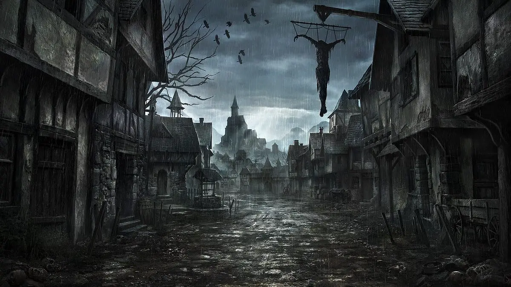

---
{"source":"Test","publish":true,"draft":false,"title":"Auf zum Storchen","tags":["Tagebuch"],"kampagne":"TMBT","PassFrontmatter":true}
---

# Auf zum Storchen

---

> [!infobox| c-red]
>
>
> ### Auf zum Storchen
>
> 
> 
> |  |  |
> | ---- | ---- |
> | **RL Datum** | 06.03.2021 |
> | **Ereignisse von** | - |
> | **bis** | - |
> | **Dramatis Personae** | Linus Klepzig, Ottwin Plaffbach, Oma Moscher, Goran Uhl |
> | **Orte Besucht** | Untergard, Die Brücke von Untergard |
> | **Ziele & Pläne** | `=[[TMBT Ep2]].Goals` |
> | **Erfolge** | `=[[TMBT Ep2]].Successes` |
> | **Gegenstände** | - |

## Ereignisse:

Unsere Helden beweisen einmal mehr, dass die Stadtwache von Untergard ohne sie es wohl nicht schaffte, die Stadt vor den organisierten Attacken der Bestienmenschen zu verteidigen. In einer Schlacht im Nordosten der Stadt schlugen die Freunde Seite an Seite mit vier Mannen der Stadtwache die Eindringlinge zurück. Jedoch nicht ohne Verluste zu beklagen. Die Stadtwache und Untergard wurden um drei Mitglieder dezimiert, ihr Tod ist ein teurer Preis, den die Stadt zu zahlen hat.
Spätestens jetzt sollte die Nachricht herum gegangen sein, dass diese Attacken seitens der Bestienmenschen nicht mehr wahllos, in geringer Zahl und unorganisiert statt finden.
Auch gilt zu klären, welche Mächte dahinter stecken. Diese haben aber scheinbar auch etwas mit der Peitsche zu tun, die Windo seinem Träger gewaltvoll entnahm. Einen Beweis hierfür liefert der Stallbursche... , der sich nicht zurück halten konnte und die Peitsche berührte. Eine Zeit lang sah es nicht gut aus um den jungen Burschen - von ominöser, offensichtlich dunkler Macht besessen, erbebte und verkrampfte sein schwächliche Körper. Jedoch konnte das gezielte Eingreifen Windos und die Hilfe von Oma ... das Schlimmste verhindern.
Die kräuter- und elixierkundliche Frau scheint ebenfalls in den Fokus des Hexenjägers gerückt - scheinbar bemessen sich ihre Kräfte höher, als sie es zugeben mag.
Wie weit sich das dunkle Treiben der Bestienmenschen und deren Anhängern sich durch die Lande zieht, werden unsere Protagonisten erfahren, wenn sie sich auf den Weg begeben, den besten Freund Sals zu finden und wohlmöglich zu retten - wenn das Schicksal ihm bisher mit dem Tode verschonte.