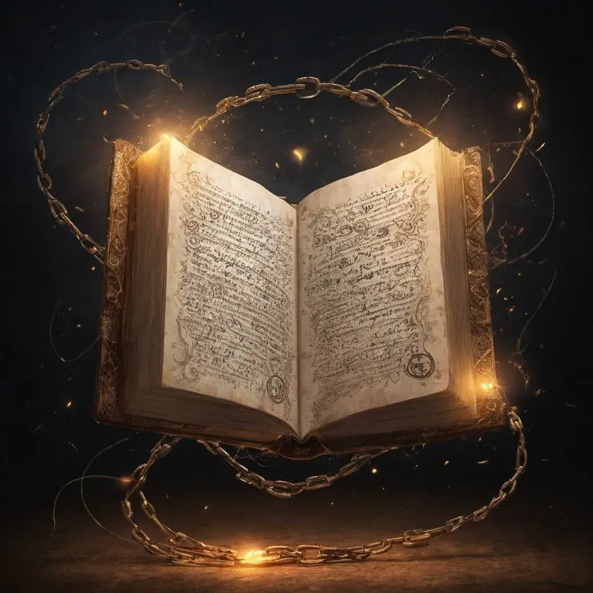

---
{"source":"Test","publish":true,"draft":false,"title":"Eine Nacht im Storchen","tags":["Tagebuch"],"kampagne":"TMBT","path":"Tagebuch/Through Mud, Blood & Tears/3. Eine Nacht im Storchen.md","permalink":"/tagebuch/through-mud-blood-and-tears/3-eine-nacht-im-storchen/","PassFrontmatter":true}
---

# Eine Nacht im Storchen

---

> [!infobox| c-red]
>
>
> ### Eine Nacht im Storchen
>
> 
> 
> |  |  |
> | ---- | ---- |
> | **RL Datum** | 06.03.2021 |
> | **Ereignisse von** | - |
> | **bis** | - |
> | **Dramatis Personae** | Bertram Kronberg, Rulf Kronberg, Ursula Kronberg, Anton Brukheim |
> | **Orte Besucht** | Untergard, Der trunkene Storch |
> | **Ziele & Pläne** | `=[[TMBT Ep3]].Goals` |
> | **Erfolge** | `=[[TMBT Ep3]].Successes` |
> | **Gegenstände** | - |

## Ereignisse:

Die Rekken schleichen auf den langsamsten Pferden die Sie finden konnten von Untergart Richtung des betrunkenen Storchen. Hinter dem Stadttor wartet auf Sie ein Schlachtefeld und ein ekelhafter gestank und Bruder Hom übergibt sich angewiedert in das Gestrüpp.
Im Wald, ca. 1 Stunde südlich von Untergart, entdeckt Window aus den Baumkronen schleichend, auf sichere Entfernung ein Lager von Grünhäuten.
Leise und galant schleichen Sie sich im großen Bogen um das Lager. 
Sie sehen Orks, die Menschenfleisch braten. Die Leiche scheint Bruder Homm nicht unbekannt zu sein doch er kann alles bei sich behalten.
Am Storchen angekommen schlachten sie 4 Harpyen ab und treffen auf die Familie Kronberg.
Verängstigt durch die Harpyen sitzt Fip am Haus.
Rulf kümmert sich sofort um die Pferde der Überaschungsgäste doch es scheint ihm nicht gut zu gehen, er zuckt seltsam und fühlt sich gar nicht gut.
In der Stube der Familie Kronber angekommen spürt Bruder Hom das Verlangen des Feuers, doch er kann diesem wiederstehen...vorerst.
Er erinnert er sich an ein spaßiges Würfelspiel, dass vor einigen Tagen in dieser Stube stattfand.
In den abendlichen Gesprächen erfährt Sal von dem Vater der Familie, Bertram, dass auf der einen Holzmünze die er bei sich trägt (in der Truhe des Halblinghändlers gefunden) das Zwergensymbol Charak Kadrim zu sehen ist.
Als Sal die Briefe von Wecklen Bertram unter 4 Augen präsentiert, läuft es auch ihm kalt den Rücken runter und Bertram schrickt zurück. (Symbol mit Fisch/Auge)
Der Schuldschein ist auf eine Zwergenstadt - Charak Wyrm - geschrieben.
Sal bedankt sich innig über Bertrams und Ursulas hilfe, vor allem weil Ursula seinen Rucksack, oder Smithers Katzenkloo, sauber macht.
Beim Würfelspiel überzeugt Sal, wieder einmal. Selbst Anton Brukheim, der Fahrende Händler kann ihm nicht das Wasser reichen, sondern öffnet nur seinen Geldbeutel.
Rulf, (Sals bester Kumpel) sieht gar nicht gut aus. Erwirkt verwirrt und geht zu bett, auch der erzwungene Schlummertrunk hilft ihm nicht wirklich. Er geht zu Bett.
Window entspannt derweil auf dem weichen Bärenfell der Kronbergs. Seine Kräfte wieder gesammelt hält er Wache an der Tür des Storchen und kümmert sich um den verängstigten Fip, der daraufhin sich wieder in die stürmische Nacht aufschwingt.
In der Nacht wartet eine kleine Armee von Bestienmenschen, ein rießiger Minotaurus-Rammbock, einigen Säbelträger und ein Schamane im Hintergrund, vor den Toren des betrunkenen Storchens.
Die sich fremden Verteidiger bereiten mit Hilfe eines Schwarzpulverfasses, eine List für den überdimensionale Minotaurus vor. Selbst Anton, Bertram und Ursula halfen Brandbomen für die Eindringlinge vorzubereiten. 
Während Sal sich weiter verzweifelt um seinen besten Freund kümmert und ihn in um und um das haus herum hinterherjagt.
Im wohl richtigen Moment entzündet bruder Hom mit letzter Kraft das schwarzpulverfass und die Brandbomben verfehlen nicht ihre wirkung. 
Rulf geht es nicht besser, er rennt aus dem Haus in Richtung tor und will seine Freunde hereinlassen.
Er scheint besessen oder ähnliches. 
Während die Todeslustigen das Toor hochsprengen, den Storchen damit vorerst retten, aber auch für weitere Angriffe verwundbarer machen, schlagen sie die kleine Armee nieder. 
Die Leichen liegen vor den Toren.
Der Schamane wurde von Hom ins Nirvana geschickt und unser Bruder sieht, wie eine Art Besessenheit aus dem Schamane fährt. Er findet bei diesem einen seltsamen Felsbrocken und eine Art Ritualdolch.
Die Lebenden verbarrikadieren mit Anton’s Kutsche und dem zersprengten Tor den Zugang zum betrunkenen Storchen und lassen ihren Gemütern eine verdiente Ruhe zukommen.
Window freut sich als sein treuer Gefährte Pax auf dem Hof erscheint, doch was ist DAS???
Blutige striemen zeichnen Paxes Flanken und die Satteltaschen fehlen. Ob diese in die falschen Hände geraten sind?
Bertram und Ursula beschließen sich abwechselnd um Rulf zu kümmern, der im Bett der Eltern im Erdgeschoss liegt. 
Anton hat sich Obergeschoss zu bette gelegt und Bertram liegt im kalten Zimmer von Rulf, weil Sal das Fenster in Sorge um Rulf eingeschlagen hat. 
Hom hat es nicht einmal in sein Bett geschafft, vor Erschöpfung brach er direkt am Kamin zusammen und schläft den Schlaf der gerechten.