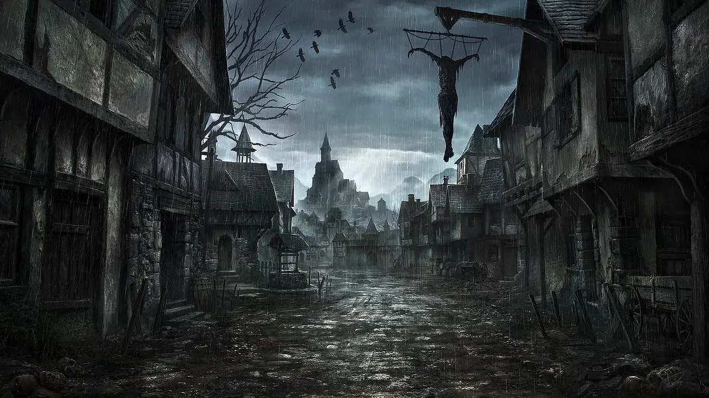

---
{"source":"Test","publish":true,"draft":false,"title":"Die Schlacht um Untergard","tags":["Tagebuch"],"kampagne":"TMBT","PassFrontmatter":true}
---

# Die Schlacht um Untergard

---

> [!infobox| c-red]
>
>
> ### Die Schlacht um Untergard
>
> 
> 
> |  |  |
> | ---- | ---- |
> | **RL Datum** | 15.05.2021 |
> | **Ereignisse von** | `=[[TMBT Ep5]].IngameDateStart` |
> | **bis** | `=[[TMBT Ep5]].IngameDateEnd` |
> | **Dramatis Personae** | Arnulf Schiller, Goran Uhl, Gotrek Gurnisson, Tristan Jäger, Oma Moscher, Bertram Kronberg, Ottwin Plaffbach, Quintus Zweisteiner, Samuel Knorrer, Edmund Gelting |
> | **Orte Besucht** | Untergard, Zum blauen Wasser |
> | **Ziele & Pläne** | `=[[TMBT Ep5]].Goals` |
> | **Erfolge** | `=[[TMBT Ep5]].Successes` |
> | **Gegenstände** | - |

## Ereignisse:

Nachdem die Truppe mit Leichtigkeit 😉 die Gruppe Orks erledigt hat, geht es mit Tristan, Gotrek, Bertram und Anton weiter Richtung Untergart. Windo wurde nach seinem heldenhaftem Kampf von Tristan genäht und gekonnt von Hom und Tristan verarztet, trotzdem ist sein Arm vorerst verkrüppelt. Sal findet eine Speerspitze aus Grimnium (Zwergenmetall). Durch Sals Beobachtungsgabe und Windos Spähen entdecken wir, dass ein oder mehrere Elfen das Orklager angegriffen haben.
Auf dem Weg trifft die Gruppe vor Untergart auf einen fremden (Menschen-) Mann am Wegesrand. Er erklärt, dass Untergart belagert wird. Die Gruppe sieht (etwa ein Dutzend) Bestienmenschen die die Stadt angreifen. Der Fremde, Samuel Knorrer, erklärt, dass das Unheil erst auf uns zu kommt, er wohnt nördlich von Untergart. Wir sehen wie die Stadt weiter angegriffen wird und Schiller killt einen angreifenden Ork der es schon auf den Turm geschafft hat.
Windo ebnet den Web mit Pax und tötet die Fernschützen, Hauptmann Uhl kämpft und tötet den Bestienmensch auf dem Turm, Hom wirft einen Feuerball auf den Rammbock, Sal greift erfolgreich den Zentauren an. Mit erneuter Leichtigkeit schlägt die Truppe die Bestienmenschen in die Flucht und rettet damit Untergart. Fast alle flüchtenden Bestienmenschen werden erledigt, Windo fetzt mit Pax den Zentaur in Stücke. Nur ein Bestienmensch kann flüchten.
Die Truppe sichert die Stadt und wird herzlich willkommen geheißen und betritt die Stadt- die Gruppe um Gotrek hat den Weg über den anderen Eingang gefunden- und trifft sich, inklusive einem verletzten Hauptmann Uhl, im blauen Wasser.
Im blauen Wasser lebt eine ausgelassene Stimmung auf, aber direkt werden die nächsten Schritte besprochen. Es scheint nirgends sicher zu sein, die Bestienmenschen sind auf dem Vormarsch. Wir erfahren, dass der „böse Hexer“ -Edmund Gelting- morgen früh verbrannt werden soll. Oma Moscha ist verschwunden, von manchen sogar für tot gehalten, eventuell hat sie sich auch in den Wäldern versteckt?
Die drei trinken gegen 18.00/19.00 noch einen (drölf) und beschließen die Nacht in der Stadt zu verbringen. Windo legt sich zum Ausruhen in den Stall wo sich auch Pax eingefunden hat und er schläft ein. Sal und Hom gehen Richtung Quintus, hören in der Scheune ein wimmerndes Geständnis des „bösen Hexers“. Hom verabredet sich mit des Fährmanns Frau für den nächsten Morgengrauen.
Bei Quintus angekommen, erlangen sie 4 alte bzw. gereifte Heiltränke. Sal muss sich beim ersten übergeben der zweite revidiert aber das Ergebnis, Sal kauft die 2 übrigen Heiltränke und mehr. Wir entdecken ein Pergament das die Schrift auf ein zweites Pergament „kopiert“. Von Pergament Nr. 6 (Kopie) fehlt jede Spur, wir schreiben darauf „Wo bist du?“
Als der Einkauf abgeschlossen ist gehen die zwei Windo einsammeln.